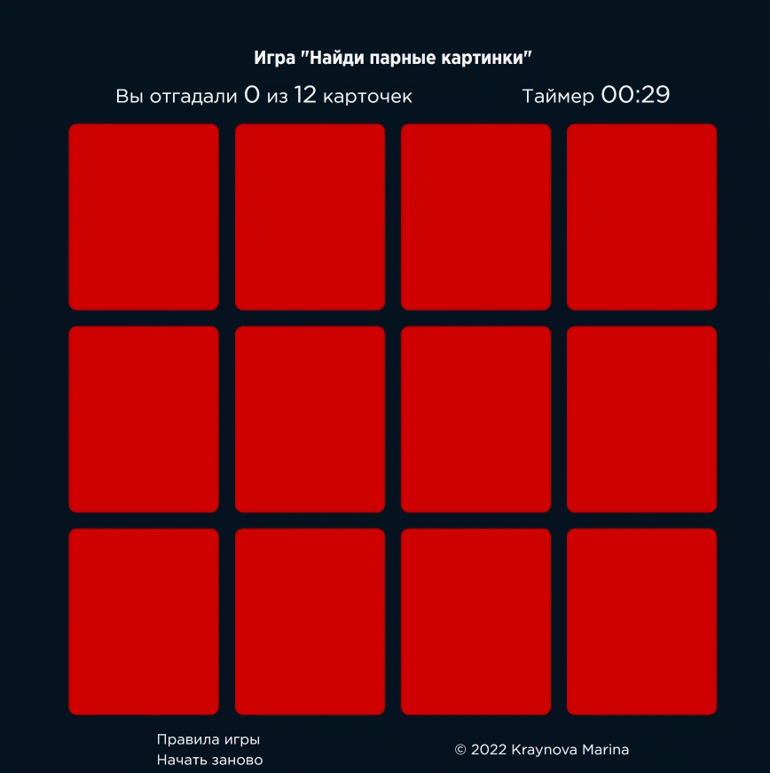

<h1 align="center">Игра "Найди пару" на JS</h1>

<h2 align="left">Описание проекта</h2>

Проект представляет собой классическую игру "Найди пару" для одного игрока. Цель игры - найти все парные карточки.

Просмотреть проект можно на GitHub Pages по ссылке: https://mgkraynova.github.io/game-memory-cards/

Цель создания проекта - закрепление навыков по JavaScript и организации классов в соответствии с принципами ООП.

**Правила игры:**
В начале игры карточки раскладываются на экране случайным образом рубашкой вверх.
Игрок открывает любые две карточки. Если цвет на них совпадает, то они остаются открытыми, и игрок открывает следующие две карточки. Если карточки не совпадают по цвету, то обе карточки переворачиваются обратно, и игрок заново начинает ход.
Игра заканчивается, когда все карты на столе открыты.

Окончание проекта - февраль 2022 года.

<h2 align="left">Использованные технологии</h2>

Внешний вид игры стилизован с помощью HTML и CSS.

Вся логика игры написана на чистом **JavaScript**:

- перед началом игры игрок выбирает длительность игры (30, 45 или 60 сек);
- на главном экране отображается таймер, по истечении установленного таймером времени появляется попап о проигрыше;
- цвет лицевой стороны карточки выбирается случайным образом;
- если игрок открывает две одинаковые карточки, то они блокируются и дальнешие действия с ними становятся недоступны;
- если игрок открывает разные карточки, то через некоторое время они переворачиваются обратно;
- в игру добавлен счетчик найденных пар карточек;
- в случае победы на экране появляется всплывающее окно, уведомляющее об этом;
- во всплывающем окне есть кнопка, позволяющая заново начать игру;
- функционал приложения организован в **5 классов** - Card, Popup, PopupWithSubmitButton, SectionForCards, TimeButton.

<h2 align="left">Планы по доработке проекта</h2>

В будущем в проект планируется добавить:

- колоду карт с картинками;
- возможность изменять количество игровых карточек.
